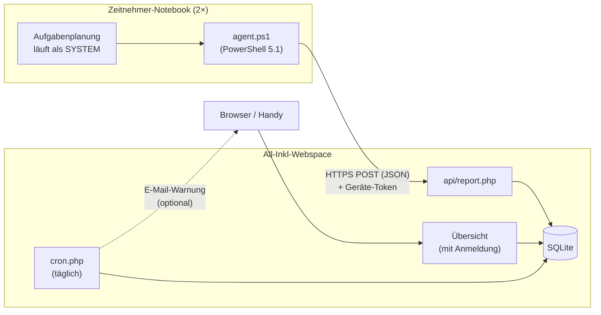

# HSGMonitorLight – Plan

## Ziel

Für jedes Zeitnehmer-Notebook aus der Ferne sehen:

- **wann** es zuletzt mit dem Internet verbunden war und **mit welcher IP** (öffentlich und lokal, dazu der Netzwerkname),
- **welchen Patch-Stand** Windows hat und ob Updates oder ein Neustart ausstehen.

**Rahmen:** zwei Notebooks mit Windows 11 und lokalen Benutzerkonten, keine Domäne und kein Intune. Als Server gibt es
nur einen All-Inkl-Webspace (PHP, Apache mit `.htaccess`, KAS). Es soll nichts kosten und kaum Pflege brauchen.

**Bewusst nicht enthalten:** Fernsteuerung, Softwareverteilung oder Befehle vom Server an die Notebooks.
Die Notebooks *melden* nur. Selbst ein gehackter Webspace kann die Geräte darüber nicht übernehmen.
Es wird auch nicht erfasst, was auf den Notebooks gemacht wird.

## Architektur



Die Verbindung geht nur in eine Richtung: Das Notebook meldet sich, der Webspace speichert die Meldungen und zeigt sie an.

## Teil 1: Agent auf den Notebooks

**Technik:** Windows PowerShell 5.1 ist auf jedem Windows vorhanden. Es muss also nichts
installiert werden, es gibt nur ein Skript, eine Konfigurationsdatei und eine geplante Aufgabe.

### Wann meldet sich das Notebook?

Die Meldung übernimmt eine geplante Aufgabe unter dem Konto **SYSTEM**. Sie läuft auch, wenn niemand angemeldet ist, und hat drei Auslöser:

1. **beim Systemstart**, 2 Minuten verzögert;
2. **bei jeder neuen Netzwerkverbindung**, also bei Ereignis 10000 in `Microsoft-Windows-NetworkProfile/Operational`.
   Das passiert 1 Minute verzögert, damit DHCP, DNS und eine eventuelle WLAN-Anmeldeseite in der Halle vorher fertig sind;
3. **stündlich**, solange das Gerät läuft.

Weitere Einstellungen der Aufgabe: keine parallelen Läufe, höchstens 10 Minuten Laufzeit, auch im Akkubetrieb.
Seit Agent 0.2.0 läuft die Aufgabe auch ohne Netzwerk, damit der Agent Offline-Zeiten vormerken kann.

### Was wird gemeldet?

| Bereich | Daten | Quelle |
|---|---|---|
| Gerät | Rechnername, Seriennummer, Modell | CIM (`Win32_BIOS`, `Win32_ComputerSystem`) |
| Windows | Edition, Version (z. B. `24H2`), **Build + UBR** (z. B. `26100.4652`), also der eigentliche Patch-Stand | Registry `HKLM\…\Windows NT\CurrentVersion` |
| Updates | letzte erfolgreiche Update-Suche, zuletzt installierte **Windows-Updates** (ohne Defender-Signaturen), Neustart ausstehend | Windows Update Agent (COM: `Microsoft.Update.Session`, `…SystemInfo`) |
| Ausstehend | Anzahl und Titel/KB der noch nicht installierten Updates (ohne Treiber, optionale Updates und Defender-Signaturen) | WUA-Suche `IsInstalled=0 and IsHidden=0 and BrowseOnly=0 and Type='Software'` |
| Defender | Modus, ob Virenschutz und Echtzeitschutz aktiv sind, Version und Datum der Definitionen | `Get-MpComputerStatus` |
| Netzwerk | aktive Verbindungen mit **Netzwerkname** (WLAN-SSID bzw. LAN), Adapter, lokale IPv4, Gateway | `Get-NetConnectionProfile`, `Get-NetIPAddress` |
| Betrieb | letzter Start, angemeldetes Konto | CIM |
| Offline | nachgereichte Lebenszeichen (Zeit, Netzwerkname), wenn frühere Meldungen nicht ankamen | `queue.json` des Agenten |

Die **öffentliche IP** meldet nicht das Notebook. Der Server liest sie selbst aus der Verbindung (`REMOTE_ADDR`).
So kann sie nicht gefälscht werden, und es braucht keinen Fremddienst. Wenn das Netz IPv6 kann,
steht dort eine IPv6-Adresse.

Diese Fallstricke sind auf einem Windows-11-25H2-Rechner nachgeprüft:

- `ProductName` in der Registry meldet auch unter Windows 11 **„Windows 10 Pro“**. Ob es Windows 11 ist,
  erkennt man stattdessen an einer Buildnummer ab 22000.
- Die neuesten Einträge im Update-Verlauf sind fast immer Defender-Signaturen (KB2267602). Für den
  Patch-Stand müssen sie herausgefiltert werden, ebenso die Store-App-Updates.
- Seit Ende 2025 steht in den Titeln der Windows-Updates der Build, z. B. „2026-09 Sicherheitsupdate (KB5129195)
  (26200.9457)“. Daraus ergibt sich unabhängig von der Sprache, **welches Monatsupdate** installiert ist und seit wann.
- Die Zeiten im Update-Verlauf sind UTC, aber nicht so gekennzeichnet.
- Die WLAN-SSID kommt aus `Get-NetConnectionProfile`. `netsh wlan` verlangt ab Windows 11 24H2 die
  Freigabe des Standorts.
- Die Suche nach ausstehenden Updates dauert 10 Sekunden bis 2 Minuten. Deshalb läuft sie höchstens alle 12 Stunden,
  und dazwischen wird das letzte Ergebnis mitgeschickt. Wurde seit der letzten Suche etwas installiert, wird sofort neu gesucht.
- Treiber-Updates meldet Windows über die Schnittstelle **nicht** als optional, obwohl sie in den Einstellungen unter
  „Optionale Updates“ stehen. Deshalb sucht der Agent nur nach Software-Updates.

### Robustheit

- Jede Meldung wird bis zu 3-mal versucht, mit Pausen von 30 Sekunden und 2 Minuten. TLS 1.2 wird ausdrücklich eingeschaltet.
- **Puffer für Offline-Zeiten:** Ist der Server nicht erreichbar, zum Beispiel im Hallen-WLAN ohne Internet,
  merkt sich der Agent ein kurzes Lebenszeichen (Zeit, Netzwerkname, höchstens 150). Er schickt es mit der nächsten
  erfolgreichen Meldung nach. Die Detailseite zeigt dann auch „ohne Verbindung zum Server“.
  Meldet Windows gar kein Internet, versucht der Agent es nur einmal statt dreimal.
- Es gibt ein eigenes Protokoll mit Rotation (höchstens 1 MB).

### Installation (`install.ps1`, einmal pro Notebook als Administrator ausführen)

1. Das Skript kopiert den Agent nach `C:\Program Files\HSGMonitorLight\`. Dort dürfen nur Administratoren schreiben.
   **Das ist wichtig:** Das Skript läuft als SYSTEM. Könnte ein Standardbenutzer es ändern, hätte er
   volle Rechte auf dem Gerät.
2. Es schreibt `C:\ProgramData\HSGMonitorLight\config.json` mit der Server-Adresse und dem Geräte-Token.
   Lesen dürfen diese Datei nur SYSTEM und Administratoren.
3. Es legt die geplante Aufgabe an, und zwar aus einer XML-Vorlage, weil sich der Ereignis-Auslöser so am saubersten einrichten lässt.
4. Es schickt sofort eine Testmeldung und zeigt das Ergebnis an.

`uninstall.ps1` entfernt alles wieder. Eine neue Agent-Version kommt auf das Gerät, indem man `install.ps1` erneut ausführt.
Eine automatische Aktualisierung gibt es bewusst nicht.

## Teil 2: Server auf dem All-Inkl-Webspace

**Technik:** PHP 8 mit PDO und **SQLite**. Die Datenbank ist eine einzige Datei, im KAS muss keine Datenbank angelegt werden.
Falls der Tarif kein SQLite hat, läuft dieselbe PDO-Schicht auch mit MySQL. Es gibt kein Framework und keinen Composer,
das Hochladen per FTP reicht.

### Verzeichnisse

```
monitor/
├── .htaccess             sperrt alles, falls der Document Root falsch gesetzt ist
├── public/               ← Document Root der Subdomain monitor.<vereinsdomain>
│   ├── index.php         Übersicht
│   ├── admin.php         Gerät anlegen, Token erneuern, Gerät löschen
│   ├── login.php         Anmeldung
│   ├── check.php         Einrichtungshilfe: prüft den Webspace, erzeugt den Passwort-Hash
│   ├── api/report.php    Annahme der Meldungen
│   ├── device.php        Details: Online-Zeiten, Updates, IP-Verlauf, Rohdaten
│   ├── download.php      Agent als ZIP (nur angemeldet, ohne Token)
│   └── cron.php          (Phase 3) täglicher Cronjob, optional Warnungen per E-Mail
├── agent/                Agent-Dateien für den Download (Kopie des Repo-Ordners agent/)
├── app/bootstrap.php     Logik, außerhalb des Document Root
├── data/                 Datenbank und Sitzungen; wird automatisch angelegt und gesperrt
└── config.php            Einstellungen; nicht im Repo, Vorlage: config.example.php
```

### Endpunkt `POST /api/report.php`

- Der Token steht im eigenen Header `X-Client-Token`. Der Standard-Header `Authorization` kommt bei PHP als
  CGI/FPM oft nicht an. Jedes Gerät hat seinen eigenen Token aus 32 Zufallsbytes. Auf dem Server liegt nur sein **SHA-256-Hash**.
- Meldungen sind auf 64 KB begrenzt. Das JSON wird geprüft und hat eine `schema_version`.
- Gespeichert werden die Empfangszeit (nach der **Serveruhr**, in UTC), die öffentliche IP, die Agent-Version und die Rohdaten.
- Die Kurzfassung in der Gerätetabelle wird aktualisiert, damit die Übersicht schnell lädt.
- Die Antwort ist `{"ok":true}`. Sie enthält bewusst keine Befehle.

### Datenbank

- `devices`: ID, Anzeigename, Token-Hash, angelegt am, zuletzt gesehen, letzte IP und ein Verweis auf die letzte Meldung.
  Die Details liest die Übersicht direkt aus dieser Meldung. So braucht ein neues Feld im Agenten keine Änderung an der Datenbank.
- `reports`: ID, Gerät, Empfangszeit, öffentliche IP, Rohdaten (JSON).
- Meldungen werden **180 Tage** aufbewahrt, pro Gerät höchstens 2000. Aufgeräumt wird bei jeder eingehenden Meldung
  des jeweiligen Geräts, dafür braucht es keinen Cronjob.
- `login_failures`: Fehlversuche bei der Anmeldung (IP und Zeit). Sie werden nach 15 Minuten gelöscht.

### Übersicht (Dashboard)

- **Zugangsschutz:** eine eigene Anmeldung. Benutzername und Passwort-Hash stehen in `config.php`, die Sitzung hält 14 Tage.
  Nach 5 Fehlversuchen ist die Anmeldung für 15 Minuten gesperrt, alle Formulare haben einen CSRF-Token.
  Ursprünglich war der KAS-Verzeichnisschutz geplant. Der schreibt aber eine eigene `.htaccess` und hätte auch
  `/api` gesperrt. Außerdem lässt sich die eigene Anmeldung lokal testen.
- **Startseite:** eine Karte pro Notebook, auch auf dem Handy gut lesbar:
  - *Zuletzt online:* Sa 20.09., 19:40 (vor 5 Tagen), dazu öffentliche IP und Netzwerkname
  - *Windows 11 24H2, Build 26100.4652*
  - **Update-Ampel** mit Begründung im Klartext. Maßstab ist das Monatsupdate: Microsoft veröffentlicht es am
    zweiten Dienstag im Monat, eine Woche danach sollte es installiert sein.
    - 🟢 **Aktuell:** Monatsupdate da, nichts ausstehend, kein Neustart nötig, Virenschutz aktiv und Definitionen höchstens 3 Tage alt;
    - 🟡 **Handlungsbedarf:** Updates ausstehend, Neustart nötig, das Monatsupdate fehlt seit einem Monat,
      Definitionen älter als 3 Tage, Update-Suche seit über 14 Tagen nicht gelungen oder seit über 14 Tagen keine Meldung;
    - 🔴 **Veraltet:** Monatsupdate fehlt seit zwei oder mehr Monaten, Virenschutz aus oder Definitionen älter als 7 Tage;
    - Treiber und optionale Updates zählen nicht. Ist Defender im Passiv-Modus (anderer Virenschutz), wird das nur angezeigt.
  - Oben steht der **nächste Patchday**. Jede Karte zeigt, von wann die Meldung ist, denn der Stand ist nur so
    aktuell wie die letzte Meldung.
- **Detailseite:** Die Online-Zeiten werden aus den Meldungen der letzten 60 Tage abgeleitet, etwa *„Sa 20.09., 13:05–19:40,
  WLAN ‚Halle‘, IP x.x.x.x“*. Nachgereichte Lebenszeichen erscheinen als „ohne Verbindung zum Server“. Außerdem zeigt
  sie ausstehende und zuletzt installierte Updates, den Verlauf der öffentlichen IP-Adressen und die Rohdaten.
- **Supportende:** Eine kleine Tabelle in der Konfiguration enthält das Supportende jeder Windows-Version
  (z. B. Windows 11 24H2 Home/Pro bis 13.10.2026). Danach richtet sich die rote Ampel. Rechtzeitig vorher wird
  die Karte gelb.

## Teil 3: Heimspiel-Bezug (optional)

- Die Übersicht liest den **Heimspiel-Kalender der Vereinswebsite** (ICS, Adresse einstellbar) und zeigt zum Beispiel
  *„Nächstes Heimspiel: Sa 04.10. · Notebook 2: 3 Updates ausstehend“*.
- **E-Mail-Warnungen (optional, ab Werk aus):** Sind sie in `config.php` eingeschaltet, schickt `cron.php`
  (KAS-Cronjob) **3 Tage vor einem Heimspiel** eine E-Mail, wenn ein Notebook gelb oder rot ist oder sich seit über 30 Tagen
  nicht gemeldet hat. Empfänger und Vorlauf lassen sich in der Konfiguration einstellen.

## Sicherheit und Datenschutz

- Übertragung nur über HTTPS. Jedes Gerät hat seinen eigenen Token. Auf dem Server liegt nur der Hash, auf dem
  Notebook darf nur SYSTEM bzw. ein Administrator den Token lesen.
- Die Agent-Dateien dürfen nur Administratoren ändern, weil der Agent als SYSTEM läuft.
- Es gibt keinen Rückkanal und keine Befehle vom Server.
- Die Übersicht ist nur nach der Anmeldung erreichbar. Die Seiten senden strenge Sicherheits-Header (CSP, noindex).
- Datenbank und Konfiguration liegen außerhalb des Web-Roots.
- **Öffentliches Repo:** Im Code stehen weder Domains noch Tokens noch Passwörter. `config.php` und die Daten
  sind per `.gitignore` ausgeschlossen.
- Es wird nur erfasst, was nötig ist: der Zustand des Geräts. Der Name des angemeldeten Kontos wird nur übertragen, weil es
  Vereinskonten sind, und lässt sich abschalten. Nach 180 Tagen wird alles gelöscht.

### Sicherheitsprüfung vom 25.09.2026

**Kann über das Tool Schadcode auf den Webspace gelangen?** Nein. Der einzige Weg hinein ist `api/report.php`,
und der verlangt einen gültigen Geräte-Token. Die Meldung wird als JSON geprüft und als Text in SQLite gespeichert.
Sie wird nie als Datei geschrieben, nie eingebunden und nie ausgeführt. Die Datenbank liegt außerhalb des Web-Roots.
Es gibt keinen Datei-Upload, kein `eval`, kein `unserialize` und keine Shell-Aufrufe. Alle SQL-Abfragen sind vorbereitet.
Jede Ausgabe wird escaped, zusätzlich verhindert die CSP eingeschleustes JavaScript.

Bei der Prüfung behoben (Version 0.1.1):
- Die Datenbank wächst nicht mehr unbegrenzt: mindestens 20 s zwischen zwei Meldungen, höchstens 32 KB pro Meldung,
  höchstens 2000 Meldungen und 180 Tage pro Gerät. Auch ein gestohlener Token kann den Webspace nicht füllen,
  den sich das Tool mit der Vereinswebsite teilt.
- Nach 5 Fehlversuchen ist die Anmeldung für 15 Minuten gesperrt. Die bisherige Wartezeit von 2 s hätte bei vielen parallelen
  Versuchen PHP-Prozesse des Webspace blockiert.
- PHP-Fehler erscheinen nie im Browser, sondern nur im Protokoll.
- `check.php` verlangt PHP 8.3 oder neuer.

Von außen geprüft: keine Verzeichnislisten, versteckte Dateien gesperrt, `config.php` und Daten nicht erreichbar
(auch nicht über `../`), keine Versionsangaben in den Kopfzeilen, Anfragen ohne Token werden abgewiesen, bevor irgendetwas
gespeichert wird.

Bewusst in Kauf genommen:
- Wer einen Token hat, kann für *dieses eine* Gerät falsche Daten melden. Lesen oder steuern kann er damit nichts.
  Gegenmittel: „Token erneuern“.
- Der Token steht nach der Installation im PowerShell-Verlauf des Admin-Kontos auf dem Notebook. Nur dieses Konto kann ihn lesen.
- Die Subdomain ist über die öffentlichen Zertifikatslisten (Certificate Transparency) auffindbar. Die Sicherheit beruht nicht
  darauf, dass die Adresse geheim bleibt.

Größtes verbleibendes Risiko liegt außerhalb des Codes: der FTP-Zugang zum Webspace. Maßnahmen dazu stehen in
[server/README.md](server/README.md#sicher-betreiben).

## Umsetzung in Phasen

| Phase | Inhalt | Wer |
|---|---|---|
| **0 – Vorbereitung** | im KAS die Subdomain `monitor.<vereinsdomain>` anlegen, SSL (Let's Encrypt) einschalten, Document Root auf `…/monitor/public` setzen; hochladen, mit `check.php` prüfen und das Passwort einrichten. Anleitung: [server/README.md](server/README.md) | du, ca. 15 min |
| **1 – Grundversion** ✅ | `report.php` mit SQLite, Übersicht mit Anmeldung, Geräteverwaltung; Agent mit Grunddaten (Build/UBR, Patch-Monat, Update-Verlauf, Neustart, Netzwerk); geplante Aufgabe mit allen drei Auslösern; `install.ps1` und `uninstall.ps1`. Lokal getestet: Agent → Endpunkt → Übersicht. Live seit 25.09.2026: Installation als SYSTEM auf einem Test-PC erfolgreich, die Notebooks folgen | Claude |
| **2 – Komfort** ✅ | Agent 0.2.0 / Server 0.2.0: ausstehende Updates, Virenschutz, Update-Ampel mit Begründung, Detailseite mit Online-Zeiten und IP-Verlauf, Puffer für Offline-Zeiten, Agent-Download in der Geräteverwaltung, Hinweis auf veraltete Agenten. Akku und Festplatte wurden bewusst weggelassen | Claude |
| **3 – Heimspiele** | Kalender der Vereinswebsite, Supportende-Tabelle, `cron.php` mit optionalen E-Mail-Warnungen | Claude |

Der Code bleibt klein, ungefähr 300 Zeilen PowerShell und 500 Zeilen PHP/HTML. So lässt er sich auch in ein paar Jahren noch lesen.

## Warum kein fertiges Tool?

- **Intune bzw. Windows-Update-Berichte:** brauchen Entra ID und Lizenzen, passen nicht zu lokalen Konten.
- **RMM-Werkzeuge** wie MeshCentral oder Tactical RMM: brauchen einen eigenen Server (Node.js/Docker). Auf einem
  Webspace lassen sie sich nicht betreiben.
- **TeamViewer, AnyDesk & Co.:** zeigen, ob ein Gerät online ist, aber keinen Patch-Stand.

## Betriebstipps (unabhängig vom Tool)

- Die Notebooks **am Tag vor dem Heimspiel** einschalten, Updates durchlaufen lassen und neu starten. So gibt es während
  des Spiels keinen Update-Neustart.
- In Windows Update die **Nutzungszeit** passend setzen, etwa 8 bis 23 Uhr.
- Die Zeitnehmer-Konten sollten **Standardbenutzer** sein und keine Administratoren. Nur dann schützen die Dateirechte oben wirklich.

## Entscheidungen

| Thema | Entscheidung |
|---|---|
| Betriebssystem | Windows 11 25H2 auf beiden Notebooks |
| Server | eigene Subdomain `monitor.<vereinsdomain>` auf dem All-Inkl-Webspace. Die echte Adresse steht nur in der Konfiguration, nicht im Repo |
| Cronjobs | im Tarif enthalten; `cron.php` läuft täglich über den KAS |
| E-Mail-Warnungen | nur optional, ab Werk ausgeschaltet |
| Lizenz | MIT (siehe [LICENSE](LICENSE)) |
