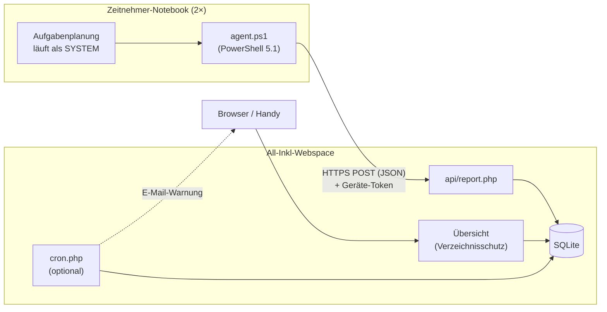

# Client-Monitor – Plan

## Ziel

Für jedes Zeitnehmer-Notebook aus der Ferne sehen:

- **wann** es zuletzt mit dem Internet verbunden war und **mit welcher IP** (öffentlich und lokal, dazu der Netzwerkname),
- **welchen Patch-Stand** Windows hat und ob Updates oder ein Neustart ausstehen.

**Rahmen:** zwei Notebooks mit lokalen Benutzerkonten, keine Domäne und kein Intune. Als Server gibt es
nur einen All-Inkl-Webspace (PHP, Apache mit `.htaccess`, KAS). Es soll nichts kosten und kaum Pflege brauchen.

**Bewusst nicht enthalten:** Fernsteuerung, Softwareverteilung oder Befehle vom Server an die Notebooks.
Die Notebooks *melden* nur. Selbst ein gehackter Webspace kann die Geräte darüber nicht übernehmen.
Es wird auch nicht erfasst, was auf den Notebooks gemacht wird.

## Architektur



Die Verbindung geht nur in eine Richtung: Das Notebook meldet sich, der Webspace speichert die Meldungen und zeigt sie an.

## Teil 1: Agent auf den Notebooks

**Technik:** Windows PowerShell 5.1 ist auf jedem Windows vorhanden. Es muss also nichts
installiert werden, es gibt nur ein Skript, eine Konfigurationsdatei und eine geplante Aufgabe.

### Wann meldet sich das Notebook?

Die Meldung übernimmt eine geplante Aufgabe unter dem Konto **SYSTEM**. Sie läuft auch, wenn niemand angemeldet ist, und hat drei Auslöser:

1. **beim Systemstart**, 2 Minuten verzögert;
2. **bei jeder neuen Netzwerkverbindung**, also bei Ereignis 10000 in `Microsoft-Windows-NetworkProfile/Operational`.
   Das passiert 1 Minute verzögert, damit DHCP, DNS und eine eventuelle WLAN-Anmeldeseite in der Halle vorher fertig sind;
3. **stündlich**, solange das Gerät läuft.

Weitere Einstellungen der Aufgabe: nur starten, wenn ein Netzwerk verbunden ist, keine parallelen Läufe, höchstens 10 Minuten Laufzeit und auch im Akkubetrieb laufen.

### Was wird gemeldet?

| Bereich | Daten | Quelle |
|---|---|---|
| Gerät | Rechnername, Seriennummer, Modell | CIM (`Win32_BIOS`, `Win32_ComputerSystem`) |
| Windows | Edition, Version (z. B. `24H2`), **Build + UBR** (z. B. `26100.4652`), also der eigentliche Patch-Stand | Registry `HKLM\…\Windows NT\CurrentVersion` |
| Updates | letzte erfolgreiche Update-Suche, zuletzt installierte **Windows-Updates** (ohne Defender-Signaturen), Neustart ausstehend | Windows Update Agent (COM: `Microsoft.Update.Session`, `…SystemInfo`) |
| Ausstehend | Anzahl und Titel/KB der noch nicht installierten Updates | WUA-Suche `IsInstalled=0 and IsHidden=0` |
| Defender | Datum der Signaturen, ob der Echtzeitschutz aktiv ist | `Get-MpComputerStatus` |
| Netzwerk | aktive Verbindungen mit **Netzwerkname** (WLAN-SSID bzw. LAN), Adapter, lokale IPv4/IPv6, Gateway | `Get-NetConnectionProfile`, `Get-NetIPConfiguration` |
| Betrieb | letzter Start, angemeldetes Konto, freier Platz auf C:, Akkustand | CIM |

Die **öffentliche IP** meldet nicht das Notebook. Der Server liest sie selbst aus der Verbindung (`REMOTE_ADDR`).
So kann sie nicht gefälscht werden, und es braucht keinen Fremddienst. Wenn das Netz IPv6 kann,
steht dort eine IPv6-Adresse.

Diese Fallstricke sind auf einem Windows-11-25H2-Rechner nachgeprüft:

- `ProductName` in der Registry meldet auch unter Windows 11 **„Windows 10 Pro“**. Ob es Windows 11 ist,
  erkennt man stattdessen an einer Buildnummer ab 22000.
- Die neuesten Einträge im Update-Verlauf sind fast immer Defender-Signaturen (KB2267602). Für den
  Patch-Stand müssen sie herausgefiltert werden.
- Die WLAN-SSID kommt aus `Get-NetConnectionProfile`. `netsh wlan` verlangt ab Windows 11 24H2 die
  Freigabe des Standorts.
- Die Suche nach ausstehenden Updates dauert 10 Sekunden bis 2 Minuten. Deshalb läuft sie höchstens alle 12 Stunden,
  und dazwischen wird das letzte Ergebnis mitgeschickt.

### Robustheit

- Jede Meldung wird bis zu 3-mal versucht, mit Pausen von 30 Sekunden und 2 Minuten. TLS 1.2 wird ausdrücklich eingeschaltet.
- **Puffer für Offline-Zeiten:** Ist der Server nicht erreichbar, zum Beispiel im Hallen-WLAN ohne Internet,
  wird die Meldung lokal gespeichert (höchstens 200 Stück) und später nachgeschickt. Man sieht dann auch
  „war an, aber ohne Internet“.
- Es gibt ein eigenes Protokoll mit Rotation (höchstens 1 MB).

### Installation (`install.ps1`, einmal pro Notebook als Administrator ausführen)

1. Das Skript kopiert den Agent nach `C:\Program Files\Client-Monitor\`. Dort dürfen nur Administratoren schreiben.
   **Das ist wichtig:** Das Skript läuft als SYSTEM. Könnte ein Standardbenutzer es ändern, hätte er
   volle Rechte auf dem Gerät.
2. Es schreibt `C:\ProgramData\Client-Monitor\config.json` mit der Server-Adresse und dem Geräte-Token.
   Lesen dürfen diese Datei nur SYSTEM und Administratoren.
3. Es legt die geplante Aufgabe an, und zwar aus einer XML-Vorlage, weil sich der Ereignis-Auslöser so am saubersten einrichten lässt.
4. Es schickt sofort eine Testmeldung und zeigt das Ergebnis an.

`uninstall.ps1` entfernt alles wieder. Eine neue Agent-Version kommt auf das Gerät, indem man `install.ps1` erneut ausführt.
Eine automatische Aktualisierung gibt es bewusst nicht.

## Teil 2: Server auf dem All-Inkl-Webspace

**Technik:** PHP 8 mit PDO und **SQLite**. Die Datenbank ist eine einzige Datei, im KAS muss keine Datenbank angelegt werden.
Falls der Tarif kein SQLite hat, läuft dieselbe PDO-Schicht auch mit MySQL. Es gibt kein Framework und keinen Composer,
das Hochladen per FTP reicht.

### Verzeichnisse

```
client-monitor/
├── public/               ← Document Root der Subdomain
│   ├── index.php         Übersicht
│   ├── device.php        Details und Verlauf eines Geräts
│   ├── admin.php         Gerät anlegen, Token erneuern, Gerät löschen
│   ├── api/report.php    Annahme der Meldungen
│   ├── cron.php          optional: Warnungen per E-Mail
│   └── .htaccess         HTTPS erzwingen, Sicherheits-Header
├── app/                  Logik, außerhalb des Document Root
├── data/monitor.sqlite   außerhalb des Document Root, zusätzlich „deny all“
└── config.php            Einstellungen; nicht im Repo, Vorlage: config.example.php
```

### Endpunkt `POST /api/report.php`

- Der Token steht im eigenen Header `X-Client-Token`. Der Standard-Header `Authorization` kommt bei PHP als
  CGI/FPM oft nicht an. Jedes Gerät hat seinen eigenen Token aus 32 Zufallsbytes. Auf dem Server liegt nur sein **SHA-256-Hash**.
- Meldungen sind auf 64 KB begrenzt. Das JSON wird geprüft und hat eine `schema_version`.
- Gespeichert werden die Empfangszeit (nach der **Serveruhr**, in UTC), die öffentliche IP, die Agent-Version und die Rohdaten.
- Die Kurzfassung in der Gerätetabelle wird aktualisiert, damit die Übersicht schnell lädt.
- Die Antwort ist `{"ok":true}`. Sie enthält bewusst keine Befehle.

### Datenbank

- `devices`: ID, Anzeigename, Token-Hash, zuletzt gesehen, letzte IP, Windows-Version/Build/UBR,
  Anzahl ausstehender Updates, ob ein Neustart nötig ist, letzte Update-Installation und weitere Kurzfelder.
- `reports`: ID, Gerät, Empfangszeit, öffentliche IP, Rohdaten (JSON).
- Meldungen werden **180 Tage** aufbewahrt. Aufgeräumt wird automatisch einmal täglich, sobald eine Meldung eingeht.

### Übersicht (Dashboard)

- **Zugangsschutz:** der Verzeichnisschutz aus dem KAS (HTTP-Basic-Auth, per Klick eingerichtet) für alles außer `/api`.
  Die Formulare auf der Admin-Seite haben zusätzlich einen CSRF-Token.
- **Startseite:** eine Karte pro Notebook, auch auf dem Handy gut lesbar:
  - *Zuletzt online:* Sa 20.09., 19:40 (vor 5 Tagen), dazu öffentliche IP und Netzwerkname
  - *Windows 11 24H2, Build 26100.4652*
  - **Update-Ampel:**
    - 🟢 keine ausstehenden Updates, und die letzte Update-Suche ist jünger als 7 Tage;
    - 🟡 Updates ausstehend, Neustart nötig oder letzte Installation älter als 40 Tage;
    - 🔴 letzte Installation älter als 70 Tage, Defender-Signaturen älter als 7 Tage oder Windows-Version ohne Support.
  - Jede Karte zeigt **„Stand vom …“**, denn der Patch-Stand ist nur so aktuell wie die letzte Meldung.
    Ein Notebook, das sechs Wochen im Schrank lag, ist in Wahrheit älter, als die Karte zeigt.
- **Detailseite:** Die Online-Zeiten werden aus den Meldungen abgeleitet, etwa *„Sa 20.09., 13:05–19:40, WLAN ‚Halle‘,
  IP x.x.x.x“*. Außerdem zeigt sie ausstehende und zuletzt installierte Updates sowie die Rohdaten.
- **Supportende:** Eine kleine Tabelle in der Konfiguration enthält das Supportende jeder Windows-Version
  (z. B. 24H2 Home/Pro bis 13.10.2026). Danach richtet sich die rote Ampel.

## Teil 3: Heimspiel-Bezug (optional)

- Die Übersicht liest den **Heimspiel-Kalender der Vereinswebsite** (ICS, Adresse einstellbar) und zeigt zum Beispiel
  *„Nächstes Heimspiel: Sa 04.10. · Notebook 2: 3 Updates ausstehend“*.
- `cron.php` läuft als Cronjob, im KAS, falls der Tarif Cronjobs hat, sonst über einen kostenlosen externen Dienst
  wie cron-job.org. **3 Tage vor einem Heimspiel** schickt er eine E-Mail, wenn ein Notebook gelb oder rot ist oder
  sich seit über 30 Tagen nicht gemeldet hat.

## Sicherheit und Datenschutz

- Übertragung nur über HTTPS. Jedes Gerät hat seinen eigenen Token. Auf dem Server liegt nur der Hash, auf dem
  Notebook darf nur SYSTEM bzw. ein Administrator den Token lesen.
- Die Agent-Dateien dürfen nur Administratoren ändern, weil der Agent als SYSTEM läuft.
- Es gibt keinen Rückkanal und keine Befehle vom Server.
- Datenbank und Konfiguration liegen außerhalb des Web-Roots.
- **Öffentliches Repo:** Im Code stehen weder Domains noch Tokens noch Passwörter. `config.php` und die Daten
  sind per `.gitignore` ausgeschlossen.
- Es wird nur erfasst, was nötig ist: der Zustand des Geräts. Der Name des angemeldeten Kontos wird nur übertragen, weil es
  Vereinskonten sind, und lässt sich abschalten. Nach 180 Tagen wird alles gelöscht.

## Umsetzung in Phasen

| Phase | Inhalt | Wer |
|---|---|---|
| **0 – Vorbereitung** | im KAS eine Subdomain anlegen (z. B. `geraete.<vereinsdomain>`), SSL (Let's Encrypt) einschalten, Document Root auf `…/client-monitor/public` setzen; `check.php` hochladen, es prüft PHP-Version, PDO-SQLite und Schreibrechte | du, ca. 15 min |
| **1 – Grundversion** | `report.php` mit SQLite und einfacher Übersicht; Agent mit Grunddaten (Build/UBR, Update-Verlauf, Neustart, Netzwerk); geplante Aufgabe mit allen drei Auslösern; `install.ps1` und `uninstall.ps1`; erst mit dem eigenen PC testen, dann mit einem Notebook | Claude |
| **2 – Komfort** | ausstehende Updates, Defender, Akku/Festplatte; Ampel; Detailseite mit Online-Zeiten; Aufbewahrungsfrist; Puffer für Offline-Zeiten | Claude |
| **3 – Heimspiele** | Kalender der Vereinswebsite, `cron.php`, E-Mail-Warnungen, Supportende-Tabelle | Claude |

Der Code bleibt klein, ungefähr 300 Zeilen PowerShell und 500 Zeilen PHP/HTML. So lässt er sich auch in ein paar Jahren noch lesen.

## Warum kein fertiges Tool?

- **Intune bzw. Windows-Update-Berichte:** brauchen Entra ID und Lizenzen, passen nicht zu lokalen Konten.
- **RMM-Werkzeuge** wie MeshCentral oder Tactical RMM: brauchen einen eigenen Server (Node.js/Docker). Auf einem
  Webspace lassen sie sich nicht betreiben.
- **TeamViewer, AnyDesk & Co.:** zeigen, ob ein Gerät online ist, aber keinen Patch-Stand.

## Betriebstipps (unabhängig vom Tool)

- Die Notebooks **am Tag vor dem Heimspiel** einschalten, Updates durchlaufen lassen und neu starten. So gibt es während
  des Spiels keinen Update-Neustart.
- In Windows Update die **Nutzungszeit** passend setzen, etwa 8 bis 23 Uhr.
- Die Zeitnehmer-Konten sollten **Standardbenutzer** sein und keine Administratoren. Nur dann schützen die Dateirechte oben wirklich.

## Offene Fragen

1. Laufen die Notebooks mit **Windows 10 oder 11**, und in welcher Version? Home oder Pro?
   Windows 10 (auch mit der verlängerten Unterstützung ESU) und Windows 11 24H2 Home/Pro bekommen **ab 13.10.2026**
   keine Sicherheitsupdates mehr.
2. Passt eine eigene Subdomain? Wie soll sie heißen?
3. Enthält der All-Inkl-Tarif Cronjobs? Das ist erst für Phase 3 wichtig.
4. Sollen Warnungen per E-Mail kommen, und an wen?
5. Welche Lizenz soll das öffentliche Repo haben, zum Beispiel MIT?
